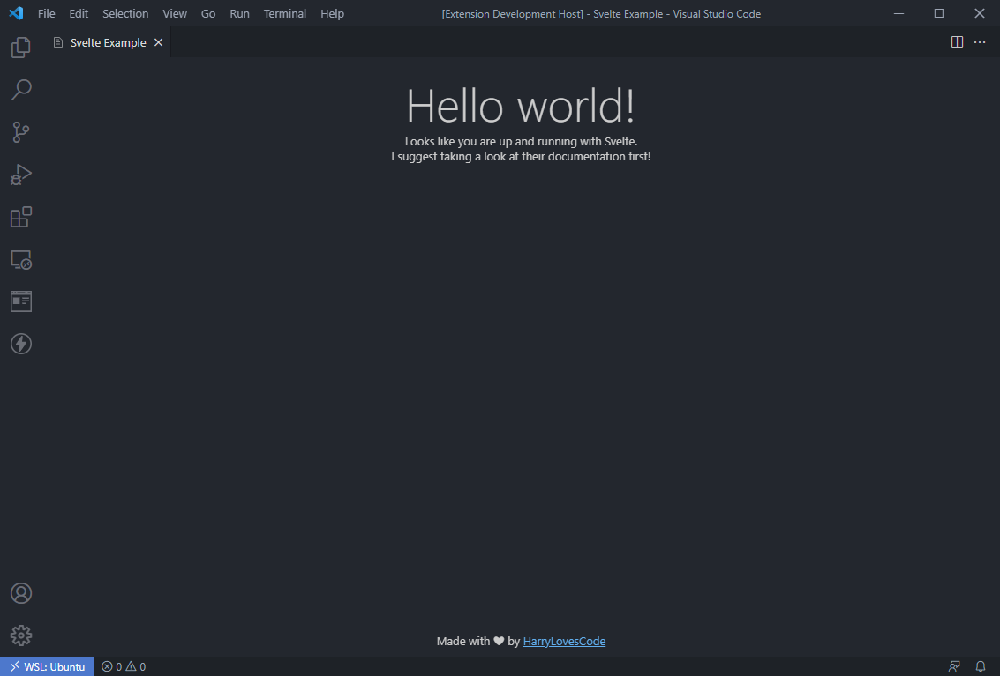

# Svelte VSCode Extension Boilerplate

## Getting Started

1. Run `npm install` in the root of the directory. 
2. Run `cd ui && npm run dev` in a Terminal Tab.
3. Press `F5` / trigger the debugger.
4. A new VSCode window should launch.
5. Open command palette `CTRL+SHIFT+P` and type in `Svelte`. You should see it under the category "Extension Examples"

## Notes

- Currently, you need to manually press the green "refresh" icon in your initial editor to trigger a refresh. I highly recommend protyping your Svelte application separately first until I can come up with a good solution.
- If you find *any* issues, please file a report. This is going to be used as a template for several other projects I am beginning and I would appreciate any help.

## Example Usage

## License

Copyright (c) 2021 Harrison (Harry) Gould.

Permission is hereby granted, free of charge, to any person obtaining a copy of this software and associated documentation files (the "Software"), to deal in the Software without restriction, including without limitation the rights to use, copy, modify, merge, publish, distribute, sublicense, and/or sell copies of the Software, and to permit persons to whom the Software is furnished to do so, subject to the following conditions:

The above copyright notice and this permission notice shall be included in all copies or substantial portions of the Software.

THE SOFTWARE IS PROVIDED "AS IS", WITHOUT WARRANTY OF ANY KIND, EXPRESS OR IMPLIED, INCLUDING BUT NOT LIMITED TO THE WARRANTIES OF MERCHANTABILITY, FITNESS FOR A PARTICULAR PURPOSE AND NONINFRINGEMENT. IN NO EVENT SHALL THE AUTHORS OR COPYRIGHT HOLDERS BE LIABLE FOR ANY CLAIM, DAMAGES OR OTHER LIABILITY, WHETHER IN AN ACTION OF CONTRACT, TORT OR OTHERWISE, ARISING FROM, OUT OF OR IN CONNECTION WITH THE SOFTWARE OR THE USE OR OTHER DEALINGS IN THE SOFTWARE.